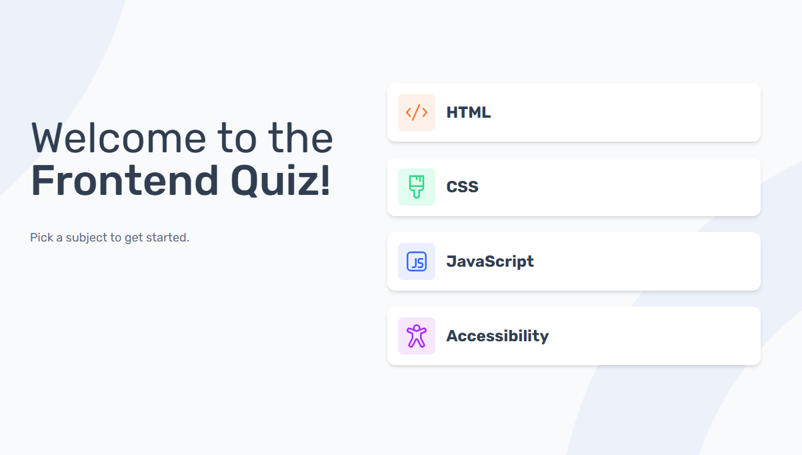

# 🎯 Frontend Quiz App

A modern quiz application built with Next.js, React, Tailwind CSS, and
JavaScript. This project allows users to test their frontend
development knowledge through an interactive quiz experience powered
by local JSON data.

## 📸 Screenshot



## 🚀 Features

- Dynamic quiz questions loaded from a local JSON file
- Interactive answer selection
- Real-time quiz progression
- Final score calculation and result display
- Responsive and user-friendly interface
- Fast performance with Next.js
- Clean and modern UI using Tailwind CSS

## 🛠️ Technologies Used

- Next.js
- React.js
- JavaScript
- Tailwind CSS
- JSON

## 📂 Project Structure

```text
frontend-quiz-app/
│
├── public/
├── src
├── app
│   ├── components/
│   ├── data/
│   │   └── data.json
│   ├── pages/
│   └── styles/
│
├── package.json
├── tailwind.config.js
├── next.config.js
└── README.md
```

## 📖 About The Project

This project is a Frontend Quiz web application designed to help users
practice and test their web development knowledge through an
interactive quiz experience.

The quiz questions and answers are loaded dynamically from a local
JSON file, demonstrating how to work with structured data and render
content dynamically in a frontend application. Users can navigate
through questions, select answers, submit the quiz, and instantly view
their final score.

The primary goal of this project was to practice frontend state
management, dynamic rendering, data handling, and user interaction
while building a smooth and engaging user experience.

This application showcases my ability to:

- Work with local JSON data
- Build interactive user interfaces
- Manage application state efficiently
- Calculate and display dynamic results
- Develop responsive applications using Next.js and React

## 🎮 How It Works

1. Start the quiz.
2. Read each question carefully.
3. Select your answer.
4. Continue through all questions.
5. Submit the quiz.
6. View your final score and results.

## ▶️ Installation & Setup

1. Clone the repository:

```bash
git clone https://github.com/mehdias63/Frontend-quiz-app.git
```

2. Navigate to the project directory:

```bash
cd frontend-quiz-app
```

3. Install dependencies:

```bash
npm install
```

4. Run the development server:

```bash
npm run dev
```

5. Open your browser and visit:

```text
http://localhost:3000
```

## 🌟 Future Improvements

- Timer for each question
- Progress indicator
- Multiple quiz categories
- Difficulty levels
- Review answers after submission
- Store quiz history using Local Storage
- Dark/Light mode support

## 🌐 Live Demo

[View Demo](https://frontend-quiz-app-seven-pearl.vercel.app/)

## 👨‍💻 Author

Developed by Mehdi Tatasadi
